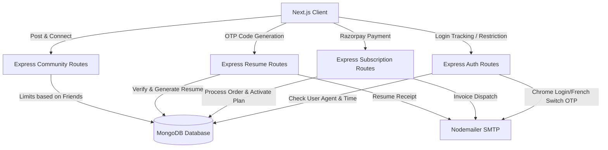

# Internshala Clone - Full Stack Project

A feature-rich clone of Internshala built with advanced security, community networking, multi-language localization, subscription licensing, and automated resume building.

---

## Architecture & System Flow



---

## Core Features Implemented

### 1. Public Space (Community Feed)
* **Student Networking**: Users can search and connect with other students bi-directionally.
* **Smart Posting Limits**: Daily posting caps are dynamically computed based on the user's friend (connection) count:
  * **0 - 1 Friend**: Max 1 post/day.
  * **2 - 9 Friends**: Max 2 posts/day.
  * **10+ Friends**: Unlimited posts/day.
* **Discovery Sidebar**: Features a "People you may know" recommendation widget for rapid networking.

### 2. Forgot Password
* **Secure String Generation**: Generates cryptographically safe random 10-character passwords composed strictly of alphabetical letters.
* **Reset Rate Limiting**: Access protection restricts password resets to a maximum of once per calendar day per user.
* **Unified Integration**: Supports credentials recovery via both registered Email and Phone number.

### 3. Subscription Payments (Razorpay)
* **Tiered Membership Plans**: Restructured with Free, Bronze, Silver, and Gold tiers controlling application submission ceilings.
* **Secure Processing Hours**: Purchases are restricted to an active execution window of **10:00 AM – 11:00 AM IST**.
* **Instant Activation & Invoicing**: Automated signature validation triggers real-time account upgrades and generates a formal invoice delivered to their email address.

### 4. Resume Builder
* **Premium Access**: Generates customizable professional resumes at a premium price of ₹50.
* **Security Gate**: Requires verification of a unique email-delivered OTP prior to invoking the Razorpay checkout widget.
* **Recruiter Integration**: Automatically attaches the generated resume data to all submitted applications.

### 5. Multi-Language Support
* **6 Fully Translated Languages**: Full-site localization support for:
  * **English** (`en`)
  * **Hindi** (`hi`)
  * **Spanish** (`es`)
  * **Portuguese** (`pt`)
  * **Chinese** (`zh`)
  * **French** (`fr`)
* **French Switch Guard**: Translating the app interface to French requests a mandatory security Email OTP verification before the language preference updates.

### 6. Login Tracking & Security Restrictions
* **History Audit Log**: Persists login details (IP Address, Browser Name, Operating System, and Device Classification) to MongoDB, rendering them inside the user's Profile page.
* **Chrome Session OTP**: Detects Google Chrome user agents and enforces a 2FA OTP verification step during authentication.
* **Mobile Layout Time Restriction**: Rejects request processing and renders a full-screen block screen on mobile devices if accessed outside the **10:00 AM – 1:00 PM IST** window.

---

## Technical Stack
* **Frontend**: Next.js (React), Redux Toolkit, Tailwind CSS, Lucide Icons
* **Backend**: Node.js, Express.js, MongoDB (Mongoose)
* **Authentication**: Firebase Client SDK & custom Database Authentication
* **Payment Processing**: Razorpay Web SDK & API
* **Email Services**: Nodemailer SMTP Engine

---

## Setup & Execution

### 1. Backend Setup
1. Navigate to `/backend`.
2. Create a `.env` file containing:
   ```env
   DATABASE_URL=your_mongodb_connection_uri
   EMAIL_USER=your_smtp_gmail_username
   EMAIL_PASS=your_smtp_gmail_app_password
   RAZORPAY_KEY_ID=your_razorpay_key_id
   RAZORPAY_KEY_SECRET=your_razorpay_key_secret
   ```
3. Run `npm install` to install dependencies.
4. Execute `node index.js` (or `npm start`) to start the server on port 5000.

### 2. Frontend Setup
1. Navigate to `/internarea`.
2. Create a `.env` file containing:
   ```env
   NEXT_PUBLIC_BACKEND_URL=http://localhost:5000
   ```
3. Run `npm install`.
4. Run `npm run dev` to start the development server.

---

## Testing & Fallback Credentials
* **Global Bypass OTP**: Enter `000000` to quickly bypass any active Email verification checks during development/testing.
* **Classic Login**: Log in with generated passwords using the "Login with Email" modal in the header.
